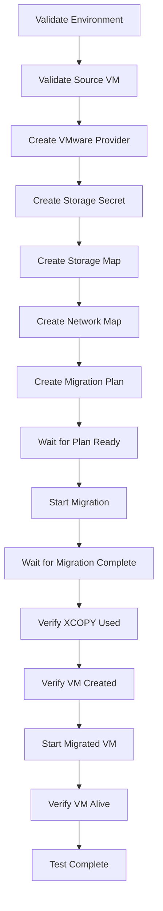

# vSphere XCOPY Volume Populator E2E Tests

This directory contains end-to-end tests for the vSphere XCOPY Volume Populator functionality. The tests verify the complete flow of migrating VMs from vSphere to OpenShift Container Platform (OCP) using the XCOPY offload feature.

## Test Overview

The E2E test suite currently includes:

### TestMigrateThinDiskVM
This test implements the "Migrate a thin disk VM" test case from the manual test plan. It verifies:

1. Source VM validation (exists, has thin disk, on XCOPY-capable datastore)
2. VMware provider creation and readiness
3. Storage secret creation with backend credentials
4. Storage map creation with XCOPY configuration
5. Network map creation
6. Migration plan creation and readiness
7. Migration execution and completion
8. XCOPY usage verification
9. Target VM creation and startup
10. VM liveness verification

## Required Environment Variables

Before running the tests, you must set the following environment variables:

### VMware Configuration
- `VMWARE_PROVIDER_NAME`: Name for the VMware provider (e.g., "vsphere-provider")
- `VMWARE_URL`: VMware vCenter/ESXi URL (e.g., "https://vcenter.example.com")
- `VMWARE_USERNAME`: VMware username with appropriate permissions
- `VMWARE_PASSWORD`: VMware password
- `VMWARE_INSECURE`: Set to "true" to skip SSL verification (optional, defaults to false)

### Source VM Configuration
- `SOURCE_DATASTORE`: Source datastore name that supports XCOPY (e.g., "netapp-iscsi-ds")
- `SOURCE_VM_NAME`: Name of the source VM to migrate (must have thin disk)

### Target Configuration
- `TARGET_STORAGE_CLASS`: OpenShift storage class that supports XCOPY (e.g., "netapp-iscsi")
- `TARGET_NAMESPACE`: Target namespace for the migrated VM (e.g., "migration-target")

### Storage Backend Configuration
- `STORAGE_VENDOR_PRODUCT`: Storage vendor identifier (e.g., "ontap", "primera3par")
- `STORAGE_SECRET_NAME`: Name of the secret containing storage backend credentials

### Kubernetes Configuration
- `KUBECONFIG`: Path to kubeconfig file (defaults to `~/.kube/config` if not set)

## Prerequisites

1. **Source VM Requirements:**
   - VM must exist on vSphere
   - VM must have at least one thin provisioned disk
   - VM must be located on a datastore that supports XCOPY operations
   - VM should be powered off before migration

2. **Storage Requirements:**
   - Source datastore and target storage class must use the same storage backend
   - Storage backend must support VAAI/XCOPY operations
   - VMware ESXi hosts must have appropriate access to the storage

3. **Network Requirements:**
   - ESXi hosts must be able to communicate with the storage backend
   - OpenShift cluster must have connectivity to the storage backend

4. **Permissions:**
   - VMware user must have permissions to access VMs and datastores
   - Storage backend credentials must have sufficient permissions for LUN operations
   - Kubeconfig must have cluster-admin or appropriate permissions for Forklift operations

## Running the Tests

### Using Make
```bash
cd cmd/vsphere-xcopy-volume-populator
make test-e2e
```

The `make test-e2e` target will:
1. Build the vsphere-xcopy-volume-populator binary
2. Validate all required environment variables are set
3. Check that kubeconfig is available
4. Run the E2E tests with verbose output

### Using Go directly
```bash
cd cmd/vsphere-xcopy-volume-populator/e2e
go test -v
```

## Example Environment Setup

```bash
# VMware configuration
export VMWARE_PROVIDER_NAME="my-vsphere"
export VMWARE_URL="https://vcenter.example.com"
export VMWARE_USERNAME="administrator@vsphere.local"
export VMWARE_PASSWORD="secret"
export VMWARE_INSECURE="true"

# Source VM configuration
export SOURCE_DATASTORE="netapp-iscsi-datastore"
export SOURCE_VM_NAME="test-vm-thin"

# Target configuration
export TARGET_STORAGE_CLASS="netapp-iscsi"
export TARGET_NAMESPACE="vm-migrations"

# Storage backend
export STORAGE_VENDOR_PRODUCT="ontap"
export STORAGE_SECRET_NAME="netapp-credentials"

# Kubernetes
export KUBECONFIG="/path/to/kubeconfig"

# Run the tests
make test-e2e
```

## Test Implementation Status

The current test implementation includes:
- ✅ Environment variable validation
- ✅ Kubeconfig validation
- ✅ Test structure and logging
- ⚠️  Helper functions are placeholders

### TODO: Complete Implementation
The following helper functions need to be implemented with actual functionality:

1. **validateSourceVM**: Connect to vSphere and verify VM configuration
2. **createVMwareProvider**: Create Forklift Provider resource via Kubernetes API
3. **createStorageSecret**: Create storage backend credentials secret
4. **createStorageMap**: Create StorageMap with XCOPY configuration
5. **createNetworkMap**: Create NetworkMap for VM network configuration
6. **createMigrationPlan**: Create migration Plan resource
7. **waitForPlanReady**: Wait for Plan to reach Ready status
8. **startMigration**: Create Migration resource to start the migration
9. **waitForMigrationComplete**: Monitor migration progress to completion
10. **verifyXCopyWasUsed**: Verify XCOPY was actually used (check logs/events)
11. **verifyVMCreated**: Verify target VM was created successfully
12. **startMigratedVM**: Start the migrated VM
13. **verifyVMIsAlive**: Verify VM is running and accessible

## Test Execution Flow



## Troubleshooting

### Common Issues

1. **Environment variable missing**: Ensure all required variables are set
2. **Kubeconfig not found**: Set `KUBECONFIG` or ensure `~/.kube/config` exists
3. **Source VM not found**: Verify VM name and vSphere connectivity
4. **Storage not XCOPY capable**: Ensure datastore and storage class use compatible storage
5. **Permission errors**: Verify VMware and Kubernetes permissions

### Debug Mode
Set `GO_TEST_VERBOSE=1` for additional debug output:
```bash
GO_TEST_VERBOSE=1 make test-e2e
```

## Contributing

When adding new test cases:
1. Follow the existing test structure
2. Add appropriate environment variable validation
3. Include comprehensive logging for each step
4. Update this README with new requirements
5. Ensure tests can run independently 